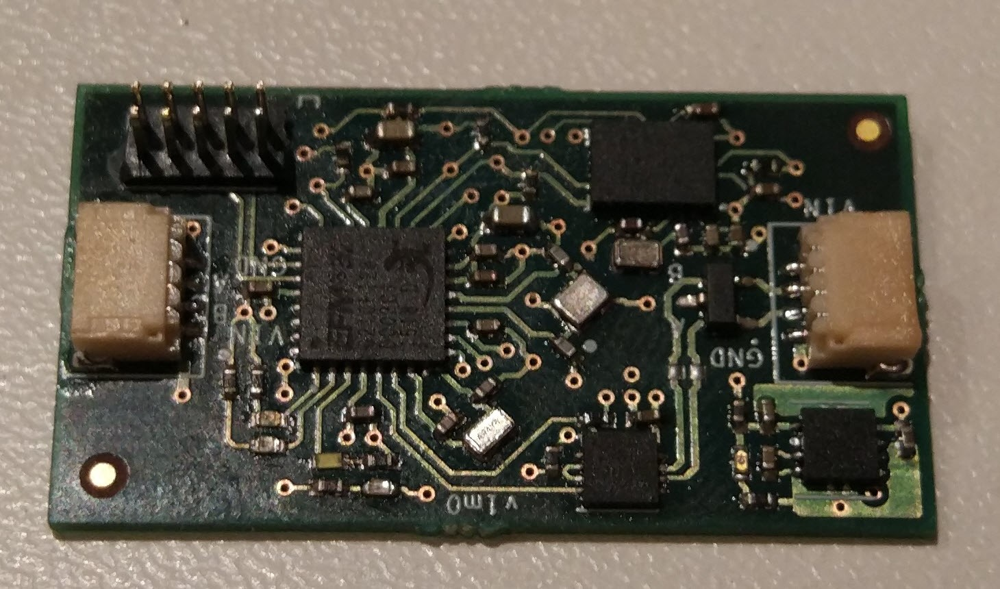
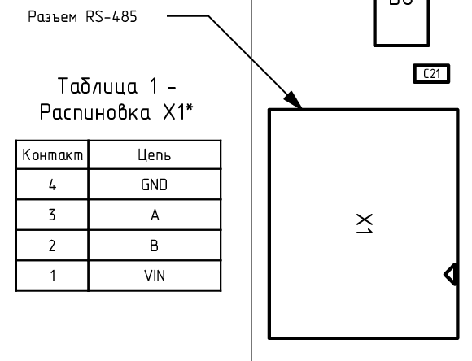

###########################
Модуль двигательной активности
###########################

==========================
Технические характеристики
==========================

* Размеры: TBA

* Напряжение питания: TBA

* Потребляемые ток, пиковый: TBA

==========================
Подключение к головному устройству
==========================

Подключение к головному устройству осуществляется по протоколу RS-485 через разъем SH04, расположенному на плате. Распиновка приведена на рисунке ниже.

==========================
Выполняемые команды
==========================

**************************
Команда на получение сырых данных
**************************

Формат запроса
==========================

Длина запроса - **8** байт.

+--------+-------------+----------------+---------------+----------------------------------------------------------------+
| Байт # | Поле        | Тип            | Значение      | Описание                                                       |
+========+=============+================+===============+================================================================+
| 0      | start_byte  | uint8_t        | **0xAA**      | Стартовый байт.                                                |
|        |             |                |               | Всегда равен **0xAA**                                          |
+--------+-------------+----------------+---------------+----------------------------------------------------------------+
| 1      | id          | uint8_t        | **0x30**      | Идентификатор получателя пакета.                               |
|        |             |                |               | **0x30** - получатель - *Датчик ДА*                            |
+--------+-------------+----------------+---------------+----------------------------------------------------------------+
| 2      | type        | uint8_t        | **0x01**      | Тип пакета.                                                    |
|        |             |                |               | **0x01** - пакет команды управления                            |
+--------+-------------+----------------+---------------+----------------------------------------------------------------+
| 3      | action      | uint8_t        | **0x00**      | *Действие*, которое необходимо выполнить.                      |
|        |             |                |               | **0x00** - *Чтение*                                            |
+--------+-------------+----------------+---------------+----------------------------------------------------------------+
| 4      | param       | uint8_t        | **0x32**      | Параметр для *действия*.                                       |
|        |             |                |               | **0x32** - Сырые данные                                        |
+--------+-------------+----------------+---------------+----------------------------------------------------------------+
| 5      | data        | uint8_t        | **0x00**      | Данные для *действия*.                                         |
|        |             |                |               | **0x00** - нет данных                                          |
+--------+-------------+----------------+---------------+----------------------------------------------------------------+
| 6      | payload     | uint8_t        | **0x00**      | Дополнительные данные для *действия*.                          |
|        |             |                |               | **0x00** - нет данных                                          |
+--------+-------------+----------------+---------------+----------------------------------------------------------------+
| 7      | checksum    | uint8_t        | **0x0D**      | Контрольная сумма пакета - младший                             |
|        |             |                |               | байт суммы всех байтов пакета                                  |
+--------+-------------+----------------+---------------+----------------------------------------------------------------+

Формат ответа
==========================

Длина ответа - **26** байт.

+--------+-------------+----------------+---------------+----------------------------------------------------------------+
| Байт # | Поле        | Тип            | Значение      | Описание                                                       |
+========+=============+================+===============+================================================================+
| 0      | start_byte  | uint8_t        | **0xAA**      | Стартовый байт. Всегда равен **0xAA**                          |
+--------+-------------+----------------+---------------+----------------------------------------------------------------+
| 1      | id          | uint8_t        | **0x01**      | Идентификатор получателя пакета                                |
|        |             |                |               | **0x01** - получатель - *Головной модуль*                      |
+--------+-------------+----------------+---------------+----------------------------------------------------------------+
| 2      | type        | uint8_t        | **0x32**      | **0x32** - *Сырые данные*                                      |
+--------+-------------+----------------+---------------+----------------------------------------------------------------+
| 3      | systime     | uint32_t       | 0xXX          | Системное время модуля в миллисекундах.                        |
+--------+             +                +---------------+                                                                +
| 4      |             |                | 0xXX          | Порядок байт - **little endian**                               |
+--------+             +                +---------------+                                                                +
| 5      |             |                | 0xXX          |                                                                |
+--------+             +                +---------------+                                                                +
| 6      |             |                | 0xXX          |                                                                |
+--------+-------------+----------------+---------------+----------------------------------------------------------------+
| 7      | acc_x       | uint16_t       | 0xXX          | Линейное ускорение по оси X                                    |
+--------+             +                +---------------+                                                                +
| 8      |             |                | 0xXX          | Порядок байт - **little endian**                               |
+--------+-------------+----------------+---------------+----------------------------------------------------------------+
| 9      | acc_y       | uint16_t       | 0xXX          | Линейное ускорение по оси Y                                    |
+--------+             +                +---------------+                                                                +
| 10     |             |                | 0xXX          | Порядок байт - **little endian**                               |
+--------+-------------+----------------+---------------+----------------------------------------------------------------+
| 11     | acc_z       | uint16_t       | 0xXX          | Линейное ускорение по оси Z                                    |
+--------+             +                +---------------+                                                                +
| 12     |             |                | 0xXX          | Порядок байт - **little endian*                                |
+--------+-------------+----------------+---------------+----------------------------------------------------------------+
| 13     | mag_x       | uint16_t       | 0xXX          | Данные магнитометра по оси X                                   |
+--------+             +                +---------------+                                                                +
| 14     |             |                | 0xXX          |  Порядок байт - **little endian**                              |
+--------+-------------+----------------+---------------+----------------------------------------------------------------+
| 15     | mag_y       | uint16_t       | 0xXX          | Данные магнитометра по оси Y                                   |
+--------+             +                +---------------+                                                                +
| 16     |             |                | 0xXX          | Порядок байт - **little endian**                               |
+--------+-------------+----------------+---------------+----------------------------------------------------------------+
| 17     | mag_z       |                | 0xXX          | Данные магнитометра по оси Z                                   |
+--------+             +                +---------------+                                                                +
| 18     |             |                | 0xXX          | Порядок байт - **little endian**                               |
+--------+-------------+----------------+---------------+----------------------------------------------------------------+
| 19     | gyro_x      | int16_t        | 0xXX          | Данные гироскопа по оси X в TBA                                |
+--------+             +                +---------------+                                                                +
| 20     |             |                | 0xXX          | Порядок байт - **little endian**                               |
+--------+-------------+----------------+---------------+----------------------------------------------------------------+
| 21     | gyro_y      | int16_t        | 0xXX          | Данные гироскопа по оси Y в TBA                                |
+--------+             +                +---------------+                                                                +
| 22     |             |                | 0xXX          | Порядок байт - **little endian**                               |
+--------+-------------+----------------+---------------+----------------------------------------------------------------+
| 23     | gyro_z      | int16_t        | 0xXX          | Данные гироскопа по оси Z в TBA                                |
+--------+             +                +---------------+                                                                +
| 24     |             |                | 0xXX          | Порядок байт - **little endian**                               |
+--------+-------------+----------------+---------------+----------------------------------------------------------------+
| 25     | checksum    | uint8_t        | 0xXX          | Контрольная сумма пакета - младший                             |
|        |             |                |               | байт суммы всех байтов пакета                                  |
+--------+-------------+----------------+---------------+----------------------------------------------------------------+

Имплементация значений
==========================

* Поле **systime** содержит значение системного времени модуля с дискретностью миллисекунда

* Поля **acc_x**, **acc_y**, **acc_z** содержат значения линейного ускорения по соответствующим осям

* Поля **mag_x**, **mag_y**, **mag_z** содержат данные магнитометра по соответствующим осям

* Поля **gyro_x**, **gyro_y**, **gyro_z** содержат данные гироскопа по соответствующим осям

Примеры
==========================

Все команды приведены в HEX-формате без указания **0x**

*Запрос:* ``AA 30 01 00 32 00 00 0D``

*Ответ:* ``AA 01 32 xx xx xx xx xx xx xx xx xx xx xx xx xx xx xx xx xx xx xx xx xx xx xx``

*Интерпретация ответа:* 

* тип пакета - сырые данные ДА

* systime = , 

* acc_x = ,

* acc_y = ,

* acc_z = ,

* mag_x = ,

* mag_y = ,

* mag_z = ,

* gyro_x = ,

* gyro_y = ,

* gyro_z = .

**************************
Команда на получение кватернионов
**************************

Формат запроса
==========================

Длина запроса - **8** байт.

+--------+-------------+----------------+---------------+----------------------------------------------------------------+
| Байт # | Поле        | Тип            | Значение      | Описание                                                       |
+========+=============+================+===============+================================================================+
| 0      | start_byte  | uint8_t        | **0xAA**      | Стартовый байт.                                                |
|        |             |                |               | Всегда равен **0xAA**                                          |
+--------+-------------+----------------+---------------+----------------------------------------------------------------+
| 1      | id          | uint8_t        | **0x30**      | Идентификатор получателя пакета.                               |
|        |             |                |               | **0x40** - получатель - *Датчик ДА*                            |
+--------+-------------+----------------+---------------+----------------------------------------------------------------+
| 2      | type        | uint8_t        | **0x01**      | Тип пакета.                                                    |
|        |             |                |               | **0x01** - пакет команды управления                            |
+--------+-------------+----------------+---------------+----------------------------------------------------------------+
| 3      | action      | uint8_t        | **0x00**      | *Действие*, которое необходимо выполнить.                      |
|        |             |                |               | **0x00** - *Чтение*                                            |
+--------+-------------+----------------+---------------+----------------------------------------------------------------+
| 4      | param       | uint8_t        | **0x31**      | Параметр для *действия*.                                       |
|        |             |                |               | **0x40** - Данные кватернионов                                 |
+--------+-------------+----------------+---------------+----------------------------------------------------------------+
| 5      | data        | uint8_t        | **0x00**      | Данные для *действия*.                                         |
|        |             |                |               | **0x00** - нет данных                                          |
+--------+-------------+----------------+---------------+----------------------------------------------------------------+
| 6      | payload     | uint8_t        | **0x00**      | Дополнительные данные для *действия*.                          |
|        |             |                |               | **0x00** - нет данных                                          |
+--------+-------------+----------------+---------------+----------------------------------------------------------------+
| 7      | checksum    | uint8_t        | **0x0C**      | Контрольная сумма пакета - младший                             |
|        |             |                |               | байт суммы всех байтов пакета                                  |
+--------+-------------+----------------+---------------+----------------------------------------------------------------+

Формат ответа
==========================

Длина ответа - **16** байт.

+--------+-------------+----------------+---------------+----------------------------------------------------------------+
| Байт # | Поле        | Тип            | Значение      | Описание                                                       |
+========+=============+================+===============+================================================================+
| 0      | start_byte  | uint8_t        | **0xAA**      | Стартовый байт. Всегда равен **0xAA**                          |
+--------+-------------+----------------+---------------+----------------------------------------------------------------+
| 1      | id          | uint8_t        | **0x01**      | Идентификатор получателя пакета                                |
|        |             |                |               | **0x01** - получатель - *Головной модуль*                      |
+--------+-------------+----------------+---------------+----------------------------------------------------------------+
| 2      | type        | uint8_t        | **0x31**      | **0x31** - *Данные кватернионов*                               |
+--------+-------------+----------------+---------------+----------------------------------------------------------------+
| 3      | systime     | uint32_t       | 0xXX          | Системное время модуля в миллисекундах.                        |
+--------+             +                +---------------+                                                                +
| 4      |             |                | 0xXX          | Порядок байт - **little endian**                               |
+--------+             +                +---------------+                                                                +
| 5      |             |                | 0xXX          |                                                                |
+--------+             +                +---------------+                                                                +
| 6      |             |                | 0xXX          |                                                                |
+--------+-------------+----------------+---------------+----------------------------------------------------------------+
| 7      | w           | uint16_t       | 0xXX          |                                                                |
+--------+             +                +---------------+                                                                +
| 8      |             |                | 0xXX          | Порядок байт - **little endian**                               |
+--------+-------------+----------------+---------------+----------------------------------------------------------------+
| 9      | x           | uint16_t       | 0xXX          |                                                                |
+--------+             +                +---------------+                                                                +
| 10     |             |                | 0xXX          | Порядок байт - **little endian**                               |
+--------+-------------+----------------+---------------+----------------------------------------------------------------+
| 11     | y           |uint16_t        |0xXX           |                                                                |
+--------+             +                +               +                                                                +
|12      |             |                |               | Порядок байт - **little endian**                               |
+--------+-------------+----------------+---------------+----------------------------------------------------------------+
|13      | z           |uint16_t        |0xXX           |                                                                |
+--------+             +                +               +                                                                +
|14      |             |                |               | Порядок байт - **little endian**                               | 
+--------+-------------+----------------+---------------+----------------------------------------------------------------+
|15      | checksum    | uint8_t        | 0xXX          | Контрольная сумма пакета - младший                             |
|        |             |                |               | байт суммы всех байтов пакета                                  |
+--------+-------------+----------------+---------------+----------------------------------------------------------------+

Имплементация значений
==========================

* Поле **systime** содержит значение системного времени модуля с дискретностью миллисекунда

* Поля **w**, **x**, **y**, **z** содержат значения кватернионов

Примеры
==========================

Все команды приведены в HEX-формате без указания **0x**

*Запрос:* ``AA 30 01 00 31 00 00 0C``

*Ответ:* ``AA 01 31 xx xx xx xx xx xx xx xx xx xx xx xx xx``

*Интерпретация ответа:* 

* тип пакета - данные кватерниона

* systime = , 

* w = ,

* x = ,

* y = ,

* z = .

**************************
Команда на получение углов Эйлера
**************************

Формат запроса
==========================

Длина запроса - **8** байт.

+--------+-------------+----------------+---------------+----------------------------------------------------------------+
| Байт # | Поле        | Тип            | Значение      | Описание                                                       |
+========+=============+================+===============+================================================================+
| 0      | start_byte  | uint8_t        | **0xAA**      | Стартовый байт.                                                |
|        |             |                |               | Всегда равен **0xAA**                                          |
+--------+-------------+----------------+---------------+----------------------------------------------------------------+
| 1      | id          | uint8_t        | **0x30**      | Идентификатор получателя пакета.                               |
|        |             |                |               | **0x30** - получатель - *Датчик ДА*                            |
+--------+-------------+----------------+---------------+----------------------------------------------------------------+
| 2      | type        | uint8_t        | **0x01**      | Тип пакета.                                                    |
|        |             |                |               | **0x01** - пакет команды управления                            |
+--------+-------------+----------------+---------------+----------------------------------------------------------------+
| 3      | action      | uint8_t        | **0x00**      | *Действие*, которое необходимо выполнить.                      |
|        |             |                |               | **0x00** - *Чтение*                                            |
+--------+-------------+----------------+---------------+----------------------------------------------------------------+
| 4      | param       | uint8_t        | **0x30**      | Параметр для *действия*.                                       |
|        |             |                |               | **0x30** - *Данные углов Эйлера*.                              |
+--------+-------------+----------------+---------------+----------------------------------------------------------------+
| 5      | data        | uint8_t        | **0x00**      | Данные для *действия*.                                         |
|        |             |                |               | **0x00** - нет данных                                          |
+--------+-------------+----------------+---------------+----------------------------------------------------------------+
| 6      | payload     | uint8_t        | **0x00**      | Дополнительные данные для *действия*.                          |
|        |             |                |               | **0x00** - нет данных                                          |
+--------+-------------+----------------+---------------+----------------------------------------------------------------+
| 7      | checksum    | uint8_t        | **0x0B**      | Котрольная сумма пакета - младший                              |
|        |             |                |               | байт суммы всех байтов пакета                                  |
+--------+-------------+----------------+---------------+----------------------------------------------------------------+

Формат ответа
==========================

Длина ответа - **20** байт.
ы
+--------+-------------+----------------+---------------+----------------------------------------------------------------+
| Байт # | Поле        | Тип            | Значение      | Описание                                                       |
+========+=============+================+===============+================================================================+
| 0      | start_byte  | uint8_t        | **0xAA**      | Стартовый байт. Всегда равен **0xAA**                          |
+--------+-------------+----------------+---------------+----------------------------------------------------------------+
| 1      | id          | uint8_t        | **0x01**      | Идентификатор получателя пакета                                |
|        |             |                |               | **0x01** - получатель - *Головной модуль*                      |
+--------+-------------+----------------+---------------+----------------------------------------------------------------+
| 2      | type        | uint8_t        | **0x30**      | **0x30** - *Данные углов Эйлера*                               |
+--------+-------------+----------------+---------------+----------------------------------------------------------------+
| 3      | systime     | uint32_t       | 0xXX          | Системное время модуля в миллисекундах.                        |
+--------+             +                +---------------+                                                                +
| 4      |             |                | 0xXX          | Порядок байт - **little endian**                               |
+--------+             +                +---------------+                                                                +
| 5      |             |                | 0xXX          |                                                                |
+--------+             +                +---------------+                                                                +
| 6      |             |                | 0xXX          |                                                                |
+--------+-------------+----------------+---------------+----------------------------------------------------------------+
| 7      | heading     | uint16_t       | 0xXX          | Один из углов Эйлера - рысканье                                |
+--------+             +                +---------------+                                                                +
| 8      |             |                | 0xXX          | Порядок байт - **little endian**                               |
+--------+-------------+----------------+---------------+----------------------------------------------------------------+
| 9      | roll        | uint16_t       | 0xXX          | Один из углов Эйлера - крен                                    |
+--------+             +                +---------------+                                                                +
| 10     |             |                | 0xXX          | Порядок байт - **little endian**                               |
+--------+-------------+----------------+---------------+----------------------------------------------------------------+
| 11     | pitch       | uint16_t       | 0xXX          | Один из углов Эйлера - тангаж                                  |
+--------+             +                +               +                                                                +
| 12     |             |                |               | Порядок байт - **little endian**                               |
+--------+-------------+----------------+---------------+----------------------------------------------------------------+
| 13     | acc_x       | uint16_t       | 0xXX          | Линейное ускорение по оси X                                    |
+--------+             +                +               +                                                                +
| 14     |             |                |               | Порядок байт - **little endian**                               |
+--------+-------------+----------------+---------------+----------------------------------------------------------------+
| 15     | acc_y       | uint16_t       | 0xXX          | Линейное ускорение по оси Y                                    |
+--------+             +                +               +                                                                +
| 16     |             |                |               | Порядок байт - **little endian**                               |
+--------+-------------+----------------+---------------+----------------------------------------------------------------+
| 17     | acc_z       | uint16_t       | 0xXX          |Линейное ускорение по оси Z                                     |
+--------+             +                +               +                                                                +
| 18      |            |                |               | Порядок байт - **little endian**                               |
+--------+-------------+----------------+---------------+----------------------------------------------------------------+
| 19     | checksum    | uint8_t        | 0xXX          | Контрольная сумма пакета - младший                             |
|        |             |                |               | байт суммы всех байтов пакета                                  |
+--------+-------------+----------------+---------------+----------------------------------------------------------------+

Имплементация значений
==========================

* Поле **systime** содержит значение системного времени модуля с дискретностью миллисекунда

* Поля **heading**, **roll** и **pitch** содержат значения углов Эйлера: рысканье, крен и тангаж соответственно 

* Поля **acc_x**, **acc_y**, **acc_z** содержат значения линейного ускорения по соответствующим осям

Примеры
==========================

Все команды приведены в HEX-формате без указания **0x**

*Запрос:* ``AA 30 01 00 30 00 00 0B``

*Ответ:* ``AA 01 30 xx xx xx xx xx xx xx xx xx xx xx xx xx xx xx xx xx``

*Интерпретация ответа:* 

* тип пакета - данные кватерниона

* systime = , 

* heading = ,

* roll = ,

* pitch = ,

* acc_x = ,

* acc_y = ,

* acc_z = .
