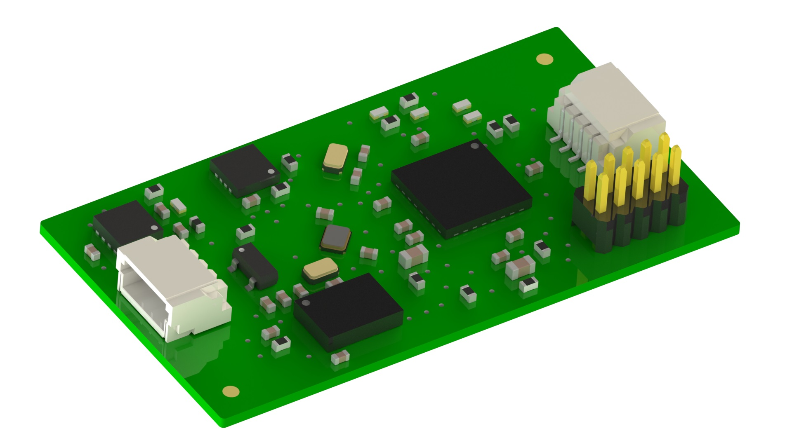

###########################
Модуль двигательной активности
###########################

==========================
Технические характеристики
==========================

* Размеры: TBA

* Напряжение питания: TBA

* Потребляемые ток, пиковый: TBA

==========================
Подключение к головному устройству
==========================

Подключение к головному устройству осуществляется по протоколу RS-485 через разъем SH04, расположенному на плате. Распиновка приведена на рисунке ниже.

.. image:: images/sh04w.png

==========================
Выполняемые команды
==========================

**************************
Команда на получение сырых данных
**************************

Формат запроса
==========================

Длина запроса - **8** байт.

+--------+-------------+----------------+---------------+----------------------------------------------------------------+
| Байт # | Поле        | Тип            | Значение      | Описание                                                       |
+========+=============+================+===============+================================================================+
| 0      | start_byte  | uint8_t        | **0xAA**      | Стартовый байт.                                                |
|        |             |                |               | Всегда равен **0xAA**                                          |
+--------+-------------+----------------+---------------+----------------------------------------------------------------+
| 1      | id          | uint8_t        | **0x30**      | Идентификатор получателя пакета.                               |
|        |             |                |               | **0x30** - получатель - *Датчик ДА*                           |
+--------+-------------+----------------+---------------+----------------------------------------------------------------+
| 2      | type        | uint8_t        | **0x01**      | Тип пакета.                                                    |
|        |             |                |               | **0x01** - пакет команды управления                            |
+--------+-------------+----------------+---------------+----------------------------------------------------------------+
| 3      | action      | uint8_t        | **0x00**      | *Действие*, которое необходимо выполнить.                      |
|        |             |                |               | **0x00** - *Чтение*                                            |
+--------+-------------+----------------+---------------+----------------------------------------------------------------+
| 4      | param       | uint8_t        | **0x32**      | Параметр для *действия*.                                       |
|        |             |                |               | **0x32** - Сырые данные                                        |
+--------+-------------+----------------+---------------+----------------------------------------------------------------+
| 5      | data        | uint8_t        | **0x00**      | Данные для *действия*.                                         |
|        |             |                |               | **0x00** - нет данных                                          |
+--------+-------------+----------------+---------------+----------------------------------------------------------------+
| 6      | payload     | uint8_t        | **0x00**      | Дополнительные данные для *действия*.                          |
|        |             |                |               | **0x00** - нет данных                                          |
+--------+-------------+----------------+---------------+----------------------------------------------------------------+
| 7      | checksum    | uint8_t        | **0x0D**      | Контрольная сумма пакета - младший                              |
|        |             |                |               | байт суммы всех байтов пакета                                  |
+--------+-------------+----------------+---------------+----------------------------------------------------------------+

Формат ответа
==========================

Длина ответа - **26** байт.

+--------+-------------+----------------+---------------+----------------------------------------------------------------+
| Байт # | Поле        | Тип            | Значение      | Описание                                                       |
+========+=============+================+===============+================================================================+
| 0      | start_byte  | uint8_t        | **0xAA**      | Стартовый байт. Всегда равен **0xAA**                          |
+--------+-------------+----------------+---------------+----------------------------------------------------------------+
| 1      | id          | uint8_t        | **0x00**      | Идентификатор получателя пакета                                |
|        |             |                |               | **0x00** - получатель - *Головное устройство*                  |
+--------+-------------+----------------+---------------+----------------------------------------------------------------+
| 2      | type        | uint8_t        | **0x32**      | **0x32** - *Сырые данные*                                      |
+--------+-------------+----------------+---------------+----------------------------------------------------------------+
| 3      | systime     | uint32_t       | 0xXX          | Системное время модуля в миллисекундах.                        |
+--------+             +                +---------------+                                                                +
| 4      |             |                | 0xXX          | Порядок байт - **little endian**                               |
+--------+             +                +---------------+                                                                +
| 5      |             |                | 0xXX          |                                                                |
+--------+             +                +---------------+                                                                +
| 6      |             |                | 0xXX          |                                                                |
+--------+-------------+----------------+---------------+----------------------------------------------------------------+
| 7      | acc_x       | uint16_t       | 0xXX          | Линейное ускорение по оси X в TBA                              |
+--------+             +                +---------------+                                                                +
| 8      |             |                | 0xXX          | Порядок байт - **little endian**                               |
+--------+-------------+----------------+---------------+----------------------------------------------------------------+
| 9      | acc_y       | uint16_t       | 0xXX          | Линейное ускорение по оси Y в TBA                              |
+--------+             +                +---------------+                                                                +
| 10     |             |                | 0xXX          | Порядок байт - **little endian**                               |
+--------+-------------+----------------+---------------+----------------------------------------------------------------+
| 11     | acc_z       | uint16_t       | 0xXX          | Линейное ускорение по оси Z в TBA                              |
+--------+             +                +---------------+                                                                +
| 12     |             |                | 0xXX          | Порядок байт - **little endian*                                |
+--------+-------------+----------------+---------------+----------------------------------------------------------------+
| 13     | mag_x       | uint16_t       | 0xXX          |  Данные магнитометра по оси X                                  |
+--------+             +                +---------------+                                                                +
| 14     |             |                | 0xXX          |  Порядок байт - **little endian*                               |
+--------+-------------+----------------+---------------+----------------------------------------------------------------+
| 15     | mag_y       | uint16_t       | 0xXX          |  Данные магнитометра по оси Y                                  |
+--------+             +                +---------------+                                                                +
| 16     |             |                | 0xXX          | Порядок байт - **little endian**                               |
+--------+-------------+----------------+---------------+----------------------------------------------------------------+
| 17     | mag_z       |                | 0xXX          | Данные магнитометра по оси Z                                   |
+--------+             +                +---------------+                                                                +
| 18     |             |                | 0xXX          |  Порядок байт - **little endian**                              |
+--------+-------------+----------------+---------------+----------------------------------------------------------------+
| 19     | gyro_x      | int16_t        | 0xXX          |  Данные гироскопа по оси X в TBA                               |
+--------+             +                +---------------+                                                                +
| 20     |             |                | 0xXX          | Порядок байт - **little endian**                               |
+--------+-------------+----------------+---------------+----------------------------------------------------------------+
| 21     | gyro_y      | int16_t        | 0xXX          | Данные гироскопа по оси Y в TBA                                |
+--------+             +                +---------------+                                                                +
| 22     |             |                | 0xXX          | Порядок байт - **little endian**                               |
+--------+-------------+----------------+---------------+----------------------------------------------------------------+
| 23     | gyro_z      | int16_t        | 0xXX          |  Данные гироскопа по оси Z в TBA                               |
+--------+             +                +---------------+                                                                +
| 24     |             |                | 0xXX          | Порядок байт - **little endian**                               |
+--------+-------------+----------------+---------------+----------------------------------------------------------------+
| 25     | checksum    | uint8_t        | 0xXX          | Контрольная сумма пакета - младший                             |
|        |             |                |               | байт суммы всех байтов пакета                                  |
+--------+-------------+----------------+---------------+----------------------------------------------------------------+

Имплементация значений
==========================

* Поле **systick** содержит значение системного времени модуля с дискретнстью миллисекунда

* Поля **acc_x**, **acc_y**, **acc_z** содержат значения линейного ускорения по соответствующим осям

* Поля **mag_x**, **mag_y**, **mag_z** содержат данные магнитометра по соответствующим осям

* Поля **gyro_x**, **gyro_y**, **gyro_z** содержат данные гироскопа по соответствующим осям

Примеры
==========================

Все команды приведены в HEX-формате без указания **0x**

*Запрос:* ``AA 30 01 00 32 00 00 0D``

*Ответ:* ``AA 00 32 xx xx xx xx xx xx xx xx 22``

*Интерпретация ответа:* 

* тип пакета - сырые данные ДА

* systime = , 

* acc_x = ,

* acc_y = ,

* acc_z = ,

* mag_x = ,

* mag_y = ,

* mag_z = ,

* gyro_x = ,

* gyro_y = ,

* gyro_z = .

**************************
Команда на получение кватернион
**************************

Формат запроса
==========================

Длина запроса - **8** байт.

+--------+-------------+----------------+---------------+----------------------------------------------------------------+
| Байт # | Поле        | Тип            | Значение      | Описание                                                       |
+========+=============+================+===============+================================================================+
| 0      | start_byte  | uint8_t        | **0xAA**      | Стартовый байт.                                                |
|        |             |                |               | Всегда равен **0xAA**                                          |
+--------+-------------+----------------+---------------+----------------------------------------------------------------+
| 1      | id          | uint8_t        | **0x30**      | Идентификатор получателя пакета.                               |
|        |             |                |               | **0x40** - получатель - *Датчик ФПГ*                           |
+--------+-------------+----------------+---------------+----------------------------------------------------------------+
| 2      | type        | uint8_t        | **0x01**      | Тип пакета.                                                    |
|        |             |                |               | **0x01** - пакет команды управления                            |
+--------+-------------+----------------+---------------+----------------------------------------------------------------+
| 3      | action      | uint8_t        | **0x00**      | *Действие*, которое необходимо выполнить.                      |
|        |             |                |               | **0x00** - *Чтение*                                            |
+--------+-------------+----------------+---------------+----------------------------------------------------------------+
| 4      | param       | uint8_t        | **0x31**      | Параметр для *действия*.                                       |
|        |             |                |               | **0x40** - Данные кватерниона                                       |
+--------+-------------+----------------+---------------+----------------------------------------------------------------+
| 5      | data        | uint8_t        | **0x00**      | Данные для *действия*.                                         |
|        |             |                |               | **0x00** - нет данных                                          |
+--------+-------------+----------------+---------------+----------------------------------------------------------------+
| 6      | payload     | uint8_t        | **0x00**      | Дополнительные данные для *действия*.                          |
|        |             |                |               | **0x00** - нет данных                                          |
+--------+-------------+----------------+---------------+----------------------------------------------------------------+
| 7      | checksum    | uint8_t        | **0x0C**      | Котрольная сумма пакета - младший                              |
|        |             |                |               | байт суммы всех байтов пакета                                  |
+--------+-------------+----------------+---------------+----------------------------------------------------------------+

Формат ответа
==========================

Длина ответа - **12** байт.

+--------+-------------+----------------+---------------+----------------------------------------------------------------+
| Байт # | Поле        | Тип            | Значение      | Описание                                                       |
+========+=============+================+===============+================================================================+
| 0      | start_byte  | uint8_t        | **0xAA**      | Стартовый байт. Всегда равен **0xAA**                          |
+--------+-------------+----------------+---------------+----------------------------------------------------------------+
| 1      | id          | uint8_t        | **0x40**      | Идентификатор получателя пакета                                |
|        |             |                |               | **0x40** - получатель - *Головное устройство*                  |
+--------+-------------+----------------+---------------+----------------------------------------------------------------+
| 2      | type        | uint8_t        | **0x40**      | **0x40** - *Данные пульса*                                     |
+--------+-------------+----------------+---------------+----------------------------------------------------------------+
| 3      | systime     | uint32_t       | 0xXX          | Системное время модуля в миллисекундах.                        |
+--------+             +                +---------------+                                                                +
| 4      |             |                | 0xXX          | Порядок байт - **little endian**                               |
+--------+             +                +---------------+                                                                +
| 5      |             |                | 0xXX          |                                                                |
+--------+             +                +---------------+                                                                +
| 6      |             |                | 0xXX          |                                                                |
+--------+-------------+----------------+---------------+----------------------------------------------------------------+
| 7      | pulse       | uint32_t       | 0xXX          | Частота сердечных сокращений в Уд/с                            |
+--------+             +                +---------------+                                                                +
| 8      |             |                | 0xXX          |                                                                |
+--------+             +                +---------------+ Порядок байт - **little endian**                               +
| 9      |             |                | 0xXX          |                                                                |
+--------+             +                +---------------+                                                                +
| 10     |             |                | 0xXX          |                                                                |
+--------+-------------+----------------+---------------+----------------------------------------------------------------+
| 11     | checksum    | uint8_t        | 0xXX          | Котрольная сумма пакета - младший                              |
|        |             |                |               | байт суммы всех байтов пакета                                  |
+--------+-------------+----------------+---------------+----------------------------------------------------------------+

Имплементация значений
==========================

TODO сведения по имплементации значений

Примеры
==========================

Все команды приведены в HEX-формате без указания **0x**

*Запрос:* ``AA 40 01 00 40 00 00 2C``

*Ответ:* ``AA 00 40 01 00 00 00 10 00 00 00 22``

*Интерпретация ответа:* тип пакета - данные пульса, systime = 1, пульс = 10 уд/мин.

**************************
Команда на получение сатурации
**************************

Формат запроса
==========================

Длина запроса - **8** байт.

+--------+-------------+----------------+---------------+----------------------------------------------------------------+
| Байт # | Поле        | Тип            | Значение      | Описание                                                       |
+========+=============+================+===============+================================================================+
| 0      | start_byte  | uint8_t        | **0xAA**      | Стартовый байт.                                                |
|        |             |                |               | Всегда равен **0xAA**                                          |
+--------+-------------+----------------+---------------+----------------------------------------------------------------+
| 1      | id          | uint8_t        | **0x40**      | Идентификатор получателя пакета.                               |
|        |             |                |               | **0x40** - получатель - *Датчик ФПГ*                           |
+--------+-------------+----------------+---------------+----------------------------------------------------------------+
| 2      | type        | uint8_t        | **0x01**      | Тип пакета.                                                    |
|        |             |                |               | **0x01** - пакет команды управления                            |
+--------+-------------+----------------+---------------+----------------------------------------------------------------+
| 3      | action      | uint8_t        | **0x00**      | *Действие*, которое необходимо выполнить.                      |
|        |             |                |               | **0x00** - *Чтение*                                            |
+--------+-------------+----------------+---------------+----------------------------------------------------------------+
| 4      | param       | uint8_t        | **0x41**      | Параметр для *действия*.                                       |
|        |             |                |               | **0x41** - *Данные сатурации крови*.                           |
+--------+-------------+----------------+---------------+----------------------------------------------------------------+
| 5      | data        | uint8_t        | **0x00**      | Данные для *действия*.                                         |
|        |             |                |               | **0x00** - нет данных                                          |
+--------+-------------+----------------+---------------+----------------------------------------------------------------+
| 6      | payload     | uint8_t        | **0x00**      | Дополнительные данные для *действия*.                          |
|        |             |                |               | **0x00** - нет данных                                          |
+--------+-------------+----------------+---------------+----------------------------------------------------------------+
| 7      | checksum    | uint8_t        | **0x2E**      | Котрольная сумма пакета - младший                              |
|        |             |                |               | байт суммы всех байтов пакета                                  |
+--------+-------------+----------------+---------------+----------------------------------------------------------------+

Формат ответа
==========================

Длина ответа - **12** байт.

+--------+-------------+----------------+---------------+----------------------------------------------------------------+
| Байт # | Поле        | Тип            | Значение      | Описание                                                       |
+========+=============+================+===============+================================================================+
| 0      | start_byte  | uint8_t        | **0xAA**      | Стартовый байт. Всегда равен **0xAA**                          |
+--------+-------------+----------------+---------------+----------------------------------------------------------------+
| 1      | id          | uint8_t        | **0x40**      | Идентификатор получателя пакета                                |
|        |             |                |               | **0x40** - получатель - *Головное устройство*                  |
+--------+-------------+----------------+---------------+----------------------------------------------------------------+
| 2      | type        | uint8_t        | **0x41**      | **0x41** - *Данные сатурации крови*                            |
+--------+-------------+----------------+---------------+----------------------------------------------------------------+
| 3      | systime     | uint32_t       | 0xXX          | Системное время модуля в миллисекундах.                        |
+--------+             +                +---------------+                                                                +
| 4      |             |                | 0xXX          | Порядок байт - **little endian**                               |
+--------+             +                +---------------+                                                                +
| 5      |             |                | 0xXX          |                                                                |
+--------+             +                +---------------+                                                                +
| 6      |             |                | 0xXX          |                                                                |
+--------+-------------+----------------+---------------+----------------------------------------------------------------+
| 7      | spo         | uint32_t       | 0xXX          | Сатурация крови в процентах.                                   |
+--------+             +                +---------------+                                                                +
| 8      |             |                | 0xXX          |                                                                |
+--------+             +                +---------------+ Порядок байт - **little endian**                               +
| 9      |             |                | 0xXX          |                                                                |
+--------+             +                +---------------+                                                                +
| 10     |             |                | 0xXX          |                                                                |
+--------+-------------+----------------+---------------+----------------------------------------------------------------+
| 11     | checksum    | uint8_t        | 0xXX          | Котрольная сумма пакета - младший                              |
|        |             |                |               | байт суммы всех байтов пакета                                  |
+--------+-------------+----------------+---------------+----------------------------------------------------------------+

Имплементация значений
==========================

TBA

Примеры
==========================

Все команды приведены в HEX-формате без указания **0x**

*Запрос:* ``AA 40 01 00 41 00 00 2C``

*Ответ:* ``AA 00 41 01 00 00 00 10 00 00 00 22``

*Интерпретация ответа:* тип пакета - данные сатурации, systime = 1, сатурация = 10%.
