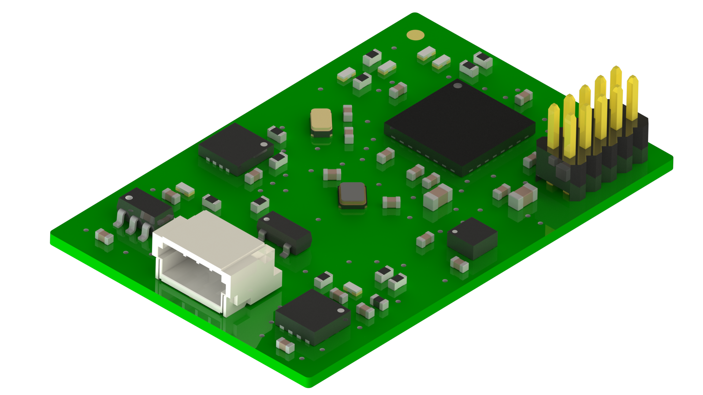

###########################
Модуль ФПГ
###########################

==========================
Технические характеристики
==========================

* Размеры: TBA

* Напряжение питания: TBA

* Потребляемые ток, пиковый: TBA

==========================
Подключение к головному устройству
==========================

Подключение к головному устройству осуществляется по протоколу RS-485 через разъем SH04, расположенному на плате модуля ФПГ. Распиновка приведена на рисунке ниже.

.. image:: images/sh04w.png

==========================
Выполняемые команды
==========================

**************************
Команда на получение сырых данных
**************************

Формат запроса
==========================

Длина запроса - **8** байт.

+--------+-------------+----------------+---------------+----------------------------------------------------------------+
| Байт # | Поле        | Тип            | Значение      | Описание                                                       |
+========+=============+================+===============+================================================================+
| 0      | start_byte  | uint8_t        | **0xAA**      | Стартовый байт.                                                |
|        |             |                |               | Всегда равен **0xAA**                                          |
+--------+-------------+----------------+---------------+----------------------------------------------------------------+
| 1      | id          | uint8_t        | **0x40**      | Идентификатор получателя пакета.                               |
|        |             |                |               | **0x40** - получатель - *Датчик ФПГ*                           |
+--------+-------------+----------------+---------------+----------------------------------------------------------------+
| 2      | type        | uint8_t        | **0x01**      | Тип пакета.                                                    |
|        |             |                |               | **0x01** - пакет команды управления                            |
+--------+-------------+----------------+---------------+----------------------------------------------------------------+
| 3      | action      | uint8_t        | **0x00**      | *Действие*, которое необходимо выполнить.                      |
|        |             |                |               | **0x00** - *Чтение*                                            |
+--------+-------------+----------------+---------------+----------------------------------------------------------------+
| 4      | param       | uint8_t        | **0x42**      | Параметр для *действия*.                                       |
|        |             |                |               | **0x42** - Сырые данные                                        |
+--------+-------------+----------------+---------------+----------------------------------------------------------------+
| 5      | data        | uint8_t        | **0x00**      | Данные для *действия*.                                         |
|        |             |                |               | **0x00** - нет данных                                          |
+--------+-------------+----------------+---------------+----------------------------------------------------------------+
| 6      | payload     | uint8_t        | **0x00**      | Дополнительные данные для *действия*.                          |
|        |             |                |               | **0x00** - нет данных                                          |
+--------+-------------+----------------+---------------+----------------------------------------------------------------+
| 7      | checksum    | uint8_t        | **0x2D**      | Котрольная сумма пакета - младший                              |
|        |             |                |               | байт суммы всех байтов пакета                                  |
+--------+-------------+----------------+---------------+----------------------------------------------------------------+

Формат ответа
==========================

Длина ответа - **26** байт.

+--------+-------------+----------------+---------------+----------------------------------------------------------------+
| Байт # | Поле        | Тип            | Значение      | Описание                                                       |
+========+=============+================+===============+================================================================+
| 0      | start_byte  | uint8_t        | **0xAA**      | Стартовый байт. Всегда равен **0xAA**                          |
+--------+-------------+----------------+---------------+----------------------------------------------------------------+
| 1      | id          | uint8_t        | **0x40**      | Идентификатор получателя пакета                                |
|        |             |                |               | **0x40** - получатель - *Головное устройство*                  |
+--------+-------------+----------------+---------------+----------------------------------------------------------------+
| 2      | type        | uint8_t        | **0x42**      | **0x42** - *Сырые данные*                                      |
+--------+-------------+----------------+---------------+----------------------------------------------------------------+
| 3      | systime     | uint32_t       | 0xXX          | Системное время модуля в миллисекундах.                        |
+--------+             +                +---------------+                                                                +
| 4      |             |                | 0xXX          | Порядок байт - **little endian**                               |
+--------+             +                +---------------+                                                                +
| 5      |             |                | 0xXX          |                                                                |
+--------+             +                +---------------+                                                                +
| 6      |             |                | 0xXX          |                                                                |
+--------+-------------+----------------+---------------+----------------------------------------------------------------+
| 7      | ppg_red     | uint32_t       | 0xXX          | Сырые данные датчика ФПГ с красного светодиода                 |
+--------+             +                +---------------+ в отсчетах АЦП. Безразмерная величина.                         +
| 8      |             |                | 0xXX          |                                                                |
+--------+             +                +---------------+ Порядок байт - **little endian**                               +
| 9      |             |                | 0xXX          |                                                                |
+--------+             +                +---------------+                                                                +
| 10     |             |                | 0xXX          |                                                                |
+--------+-------------+----------------+---------------+----------------------------------------------------------------+
| 11     | ppg_ir      | uint32_t       | 0xXX          | Сырые данные датчика ФПГ с ИК-светодиода                       |
+--------+             +                +---------------+ в отсчетах АЦП. Безразмерная величина.                         +
| 12     |             |                | 0xXX          |                                                                |
+--------+             +                +---------------+ Порядок байт - **little endian**                               +
| 13     |             |                | 0xXX          |                                                                |
+--------+             +                +---------------+                                                                +
| 14     |             |                | 0xXX          |                                                                |
+--------+-------------+----------------+---------------+----------------------------------------------------------------+
| 15     | ppg_green   | uint32_t       | 0xXX          | Сырые данные датчика ФПГ с зеленого светодиода                 |
+--------+             +                +---------------+ в осчетах АЦП. Безразмерная величина.                          +
| 16     |             |                | 0xXX          |                                                                |
+--------+             +                +---------------+ Порядок байт - **little endian**                               +
| 17     |             |                | 0xXX          |                                                                |
+--------+             +                +---------------+                                                                +
| 18     |             |                | 0xXX          |                                                                |
+--------+-------------+----------------+---------------+----------------------------------------------------------------+
| 19     | acc_x       | int16_t        | 0xXX          | Линейное ускорение по оси X в 1 м/с2 = 100 LSB.                |
+--------+             +                +---------------+                                                                +
| 20     |             |                | 0xXX          | Порядок байт - **little endian**                               |
+--------+-------------+----------------+---------------+----------------------------------------------------------------+
| 21     | acc_y       | int16_t        | 0xXX          | Линейное ускорение по оси Y в 1 м/с2 = 100 LSB.                |
+--------+             +                +---------------+                                                                +
| 22     |             |                | 0xXX          | Порядок байт - **little endian**                               |
+--------+-------------+----------------+---------------+----------------------------------------------------------------+
| 23     | acc_z       | int16_t        | 0xXX          | Линейное ускорение по оси Z в 1 м/с2 = 100 LSB.                |
+--------+             +                +---------------+                                                                +
| 24     |             |                | 0xXX          | Порядок байт - **little endian**                               |
+--------+-------------+----------------+---------------+----------------------------------------------------------------+
| 25     | checksum    | uint8_t        | 0xXX          | Котрольная сумма пакета - младший                              |
|        |             |                |               | байт суммы всех байтов пакета                                  |
+--------+-------------+----------------+---------------+----------------------------------------------------------------+

Имплементация значений
==========================

* Поле **systick** содержит значение системного времени модуля с дискретностью 1 миллисекунда.

* Поля **ppg_red**, **ppg_ir** и **ppg_green** содержат значения освещенности, снятые с фотодиода по соответствующему каналу (цвету светодиода). Размерность - отсчеты АЦП и поэтому данная величина безразмерная.

* Поля **acc_x**, **acc_y** и **acc_z** содержат значения линейного ускорения по соответствующим осям в формате 1 м/с2 = 100 LSB. Т.е 1 = 0.01 м/с2.

Примеры
==========================

Все команды приведены в HEX-формате без указания **0x**

*Запрос:* ``AA 40 01 00 42 00 00 2C``

*Ответ:* ``AA 00 42 01 00 00 00 10 00 00 00 22``

*Интерпретация ответа:* тип пакета - сырые данные ФПГ, systime = 1, пульс = 10 уд/мин.

**************************
Команда на получение пульса
**************************

Формат запроса
==========================

Длина запроса - **8** байт.

+--------+-------------+----------------+---------------+----------------------------------------------------------------+
| Байт # | Поле        | Тип            | Значение      | Описание                                                       |
+========+=============+================+===============+================================================================+
| 0      | start_byte  | uint8_t        | **0xAA**      | Стартовый байт.                                                |
|        |             |                |               | Всегда равен **0xAA**                                          |
+--------+-------------+----------------+---------------+----------------------------------------------------------------+
| 1      | id          | uint8_t        | **0x40**      | Идентификатор получателя пакета.                               |
|        |             |                |               | **0x40** - получатель - *Датчик ФПГ*                           |
+--------+-------------+----------------+---------------+----------------------------------------------------------------+
| 2      | type        | uint8_t        | **0x01**      | Тип пакета.                                                    |
|        |             |                |               | **0x01** - пакет команды управления                            |
+--------+-------------+----------------+---------------+----------------------------------------------------------------+
| 3      | action      | uint8_t        | **0x00**      | *Действие*, которое необходимо выполнить.                      |
|        |             |                |               | **0x00** - *Чтение*                                            |
+--------+-------------+----------------+---------------+----------------------------------------------------------------+
| 4      | param       | uint8_t        | **0x40**      | Параметр для *действия*.                                       |
|        |             |                |               | **0x40** - Данные пульса                                       |
+--------+-------------+----------------+---------------+----------------------------------------------------------------+
| 5      | data        | uint8_t        | **0x00**      | Данные для *действия*.                                         |
|        |             |                |               | **0x00** - нет данных                                          |
+--------+-------------+----------------+---------------+----------------------------------------------------------------+
| 6      | payload     | uint8_t        | **0x00**      | Дополнительные данные для *действия*.                          |
|        |             |                |               | **0x00** - нет данных                                          |
+--------+-------------+----------------+---------------+----------------------------------------------------------------+
| 7      | checksum    | uint8_t        | **0x2C**      | Котрольная сумма пакета - младший                              |
|        |             |                |               | байт суммы всех байтов пакета                                  |
+--------+-------------+----------------+---------------+----------------------------------------------------------------+

Формат ответа
==========================

Длина ответа - **12** байт.

+--------+-------------+----------------+---------------+----------------------------------------------------------------+
| Байт # | Поле        | Тип            | Значение      | Описание                                                       |
+========+=============+================+===============+================================================================+
| 0      | start_byte  | uint8_t        | **0xAA**      | Стартовый байт. Всегда равен **0xAA**                          |
+--------+-------------+----------------+---------------+----------------------------------------------------------------+
| 1      | id          | uint8_t        | **0x40**      | Идентификатор получателя пакета                                |
|        |             |                |               | **0x40** - получатель - *Головное устройство*                  |
+--------+-------------+----------------+---------------+----------------------------------------------------------------+
| 2      | type        | uint8_t        | **0x40**      | **0x40** - *Данные пульса*                                     |
+--------+-------------+----------------+---------------+----------------------------------------------------------------+
| 3      | systime     | uint32_t       | 0xXX          | Системное время модуля в миллисекундах.                        |
+--------+             +                +---------------+                                                                +
| 4      |             |                | 0xXX          | Порядок байт - **little endian**                               |
+--------+             +                +---------------+                                                                +
| 5      |             |                | 0xXX          |                                                                |
+--------+             +                +---------------+                                                                +
| 6      |             |                | 0xXX          |                                                                |
+--------+-------------+----------------+---------------+----------------------------------------------------------------+
| 7      | pulse       | uint32_t       | 0xXX          | Частота сердечных сокращений в Уд/с                            |
+--------+             +                +---------------+                                                                +
| 8      |             |                | 0xXX          |                                                                |
+--------+             +                +---------------+ Порядок байт - **little endian**                               +
| 9      |             |                | 0xXX          |                                                                |
+--------+             +                +---------------+                                                                +
| 10     |             |                | 0xXX          |                                                                |
+--------+-------------+----------------+---------------+----------------------------------------------------------------+
| 11     | checksum    | uint8_t        | 0xXX          | Котрольная сумма пакета - младший                              |
|        |             |                |               | байт суммы всех байтов пакета                                  |
+--------+-------------+----------------+---------------+----------------------------------------------------------------+

Имплементация значений
==========================

TODO сведения по имплементации значений

Примеры
==========================

Все команды приведены в HEX-формате без указания **0x**

*Запрос:* ``AA 40 01 00 40 00 00 2C``

*Ответ:* ``AA 00 40 01 00 00 00 10 00 00 00 22``

*Интерпретация ответа:* тип пакета - данные пульса, systime = 1, пульс = 10 уд/мин.

**************************
Команда на получение сатурации
**************************

Формат запроса
==========================

Длина запроса - **8** байт.

+--------+-------------+----------------+---------------+----------------------------------------------------------------+
| Байт # | Поле        | Тип            | Значение      | Описание                                                       |
+========+=============+================+===============+================================================================+
| 0      | start_byte  | uint8_t        | **0xAA**      | Стартовый байт.                                                |
|        |             |                |               | Всегда равен **0xAA**                                          |
+--------+-------------+----------------+---------------+----------------------------------------------------------------+
| 1      | id          | uint8_t        | **0x40**      | Идентификатор получателя пакета.                               |
|        |             |                |               | **0x40** - получатель - *Датчик ФПГ*                           |
+--------+-------------+----------------+---------------+----------------------------------------------------------------+
| 2      | type        | uint8_t        | **0x01**      | Тип пакета.                                                    |
|        |             |                |               | **0x01** - пакет команды управления                            |
+--------+-------------+----------------+---------------+----------------------------------------------------------------+
| 3      | action      | uint8_t        | **0x00**      | *Действие*, которое необходимо выполнить.                      |
|        |             |                |               | **0x00** - *Чтение*                                            |
+--------+-------------+----------------+---------------+----------------------------------------------------------------+
| 4      | param       | uint8_t        | **0x41**      | Параметр для *действия*.                                       |
|        |             |                |               | **0x41** - *Данные сатурации крови*.                           |
+--------+-------------+----------------+---------------+----------------------------------------------------------------+
| 5      | data        | uint8_t        | **0x00**      | Данные для *действия*.                                         |
|        |             |                |               | **0x00** - нет данных                                          |
+--------+-------------+----------------+---------------+----------------------------------------------------------------+
| 6      | payload     | uint8_t        | **0x00**      | Дополнительные данные для *действия*.                          |
|        |             |                |               | **0x00** - нет данных                                          |
+--------+-------------+----------------+---------------+----------------------------------------------------------------+
| 7      | checksum    | uint8_t        | **0x2E**      | Котрольная сумма пакета - младший                              |
|        |             |                |               | байт суммы всех байтов пакета                                  |
+--------+-------------+----------------+---------------+----------------------------------------------------------------+

Формат ответа
==========================

Длина ответа - **12** байт.

+--------+-------------+----------------+---------------+----------------------------------------------------------------+
| Байт # | Поле        | Тип            | Значение      | Описание                                                       |
+========+=============+================+===============+================================================================+
| 0      | start_byte  | uint8_t        | **0xAA**      | Стартовый байт. Всегда равен **0xAA**                          |
+--------+-------------+----------------+---------------+----------------------------------------------------------------+
| 1      | id          | uint8_t        | **0x40**      | Идентификатор получателя пакета                                |
|        |             |                |               | **0x40** - получатель - *Головное устройство*                  |
+--------+-------------+----------------+---------------+----------------------------------------------------------------+
| 2      | type        | uint8_t        | **0x41**      | **0x41** - *Данные сатурации крови*                            |
+--------+-------------+----------------+---------------+----------------------------------------------------------------+
| 3      | systime     | uint32_t       | 0xXX          | Системное время модуля в миллисекундах.                        |
+--------+             +                +---------------+                                                                +
| 4      |             |                | 0xXX          | Порядок байт - **little endian**                               |
+--------+             +                +---------------+                                                                +
| 5      |             |                | 0xXX          |                                                                |
+--------+             +                +---------------+                                                                +
| 6      |             |                | 0xXX          |                                                                |
+--------+-------------+----------------+---------------+----------------------------------------------------------------+
| 7      | spo         | uint32_t       | 0xXX          | Сатурация крови в процентах.                                   |
+--------+             +                +---------------+                                                                +
| 8      |             |                | 0xXX          |                                                                |
+--------+             +                +---------------+ Порядок байт - **little endian**                               +
| 9      |             |                | 0xXX          |                                                                |
+--------+             +                +---------------+                                                                +
| 10     |             |                | 0xXX          |                                                                |
+--------+-------------+----------------+---------------+----------------------------------------------------------------+
| 11     | checksum    | uint8_t        | 0xXX          | Котрольная сумма пакета - младший                              |
|        |             |                |               | байт суммы всех байтов пакета                                  |
+--------+-------------+----------------+---------------+----------------------------------------------------------------+

Имплементация значений
==========================

TBA

Примеры
==========================

Все команды приведены в HEX-формате без указания **0x**

*Запрос:* ``AA 40 01 00 41 00 00 2C``

*Ответ:* ``AA 00 41 01 00 00 00 10 00 00 00 22``

*Интерпретация ответа:* тип пакета - данные сатурации, systime = 1, сатурация = 10%.

