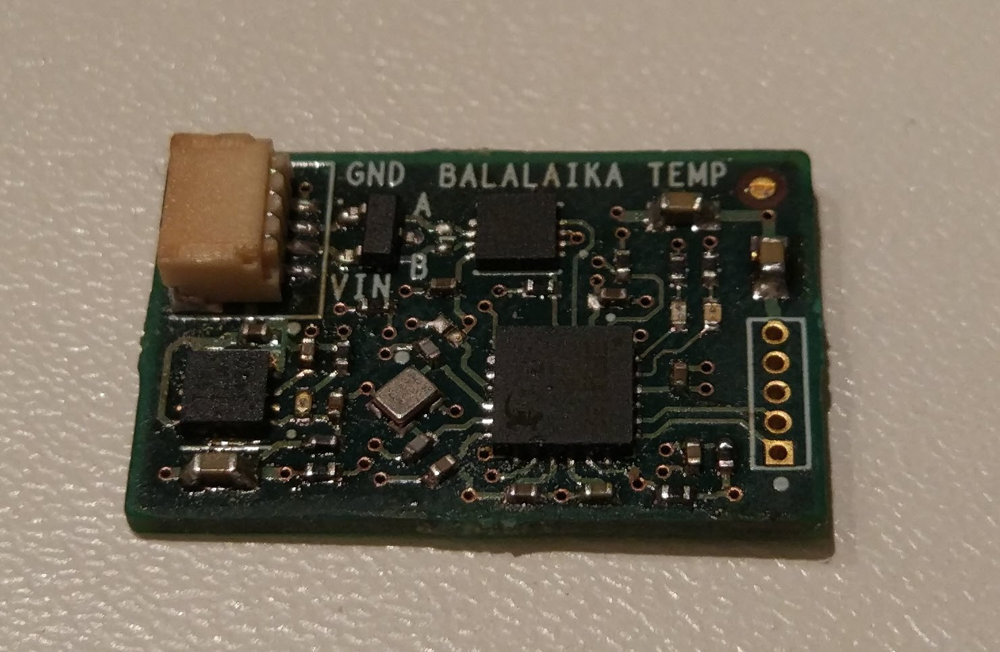

###########################
Модуль температуры
###########################

==========================
Технические характеристики
==========================

* Размеры: TBA

* Напряжение питания: TBA

* Потребляемые ток, пиковый: TBA

==========================
Подключение к головному устройству
==========================

Подключение к головному устройству осуществляется по протоколу RS-485 через разъем SH04, расположенному на плате. Распиновка приведена на рисунке ниже.

.. image:: images/sh04w.png

==========================
Выполняемые команды
==========================

**************************
Команда на получение температуры
**************************

Формат запроса
==========================

Длина запроса - **8** байт.

+--------+-------------+----------------+---------------+----------------------------------------------------------------+
| Байт # | Поле        | Тип            | Значение      | Описание                                                       |
+========+=============+================+===============+================================================================+
| 0      | start_byte  | uint8_t        | **0xAA**      | Стартовый байт.                                                |
|        |             |                |               | Всегда равен **0xAA**                                          |
+--------+-------------+----------------+---------------+----------------------------------------------------------------+
| 1      | id          | uint8_t        | **0x10**      | Идентификатор получателя пакета.                               |
|        |             |                |               | **0x10** - получатель - *Датчик температуры*                   |
+--------+-------------+----------------+---------------+----------------------------------------------------------------+
| 2      | type        | uint8_t        | **0x01**      | Тип пакета.                                                    |
|        |             |                |               | **0x01** - пакет команды управления                            |
+--------+-------------+----------------+---------------+----------------------------------------------------------------+
| 3      | action      | uint8_t        | **0x00**      | *Действие*, которое необходимо выполнить.                      |
|        |             |                |               | **0x00** - *Чтение*                                            |
+--------+-------------+----------------+---------------+----------------------------------------------------------------+
| 4      | param       | uint8_t        | **0x10**      | Параметр для *действия*.                                       |
|        |             |                |               | **0x10** - данные температуры                                  |
+--------+-------------+----------------+---------------+----------------------------------------------------------------+
| 5      | data        | uint8_t        | **0x00**      | Данные для *действия*.                                         |
|        |             |                |               | **0x00** - нет данных                                          |
+--------+-------------+----------------+---------------+----------------------------------------------------------------+
| 6      | payload     | uint8_t        | **0x00**      | Дополнительные данные для *действия*.                          |
|        |             |                |               | **0x00** - нет данных                                          |
+--------+-------------+----------------+---------------+----------------------------------------------------------------+
| 7      | checksum    | uint8_t        | **0xCB**      | Контрольная сумма пакета - младший                             |
|        |             |                |               | байт суммы всех байтов пакета                                  |
+--------+-------------+----------------+---------------+----------------------------------------------------------------+

Формат ответа
==========================

Длина ответа - **13** байт.

+--------+-------------+----------------+---------------+----------------------------------------------------------------+
| Байт # | Поле        | Тип            | Значение      | Описание                                                       |
+========+=============+================+===============+================================================================+
| 0      | start_byte  | uint8_t        | **0xAA**      | Стартовый байт. Всегда равен **0xAA**                          |
+--------+-------------+----------------+---------------+----------------------------------------------------------------+
| 1      | id          | uint8_t        | **0x01**      | Идентификатор получателя пакета                                |
|        |             |                |               | **0x01** - получатель - *Головное устройство*                  |
+--------+-------------+----------------+---------------+----------------------------------------------------------------+
| 2      | type        | uint8_t        | **0x10**      | **0x10** - *Данные темперратуры*                               |
+--------+-------------+----------------+---------------+----------------------------------------------------------------+
| 3      | sensor_id   | uint8_t        | **0x00**      | Идентификатор сенсора                                          |
+--------+-------------+----------------+---------------+----------------------------------------------------------------+
|4       | systime     | uint32_t       | 0xXX          | Системное время модуля в миллисекундах.                        |
+--------+             +                +---------------+                                                                +
| 4      |             |                | 0xXX          | Порядок байт - **little endian**                               |
+--------+             +                +---------------+                                                                +
| 5      |             |                | 0xXX          |                                                                |
+--------+             +                +---------------+                                                                +
| 6      |             |                | 0xXX          |                                                                |
+--------+-------------+----------------+---------------+----------------------------------------------------------------+
| 7      | currentTemp | uint32_t       | 0xXX          | Данные температуры в градусах Цельсия                          |
+--------+             +                +---------------+                                                                +
| 8      |             |                | 0xXX          |                                                                |
+--------+             +                +---------------+ Порядок байт - **little endian**                               +
| 9      |             |                | 0xXX          |                                                                |
+--------+             +                +---------------+                                                                +
| 10     |             |                | 0xXX          |                                                                |
+--------+-------------+----------------+---------------+----------------------------------------------------------------+
| 11     | checksum    | uint8_t        | 0xXX          | Контрольная сумма пакета - младший                             |
|        |             |                |               | байт суммы всех байтов пакета                                  |
+--------+-------------+----------------+---------------+----------------------------------------------------------------+

Имплементация значений
==========================

* Поле **systime** содержит значение системного времени модуля с дискретностью 1 миллисекунда.

* Поле **currentTemp** содержит значение температуры в градусах цельсия.

Примеры
==========================

Все команды приведены в HEX-формате без указания **0x**

*Запрос:* ``AA 10 01 00 10 00 00 CB``

*Ответ:* ``AA 01 10 xx xx xx xx xx xx xx xx xx``

*Интерпретация ответа:* 

* тип пакета - данные температуры;

* systime = , 

* температура =  °C.

